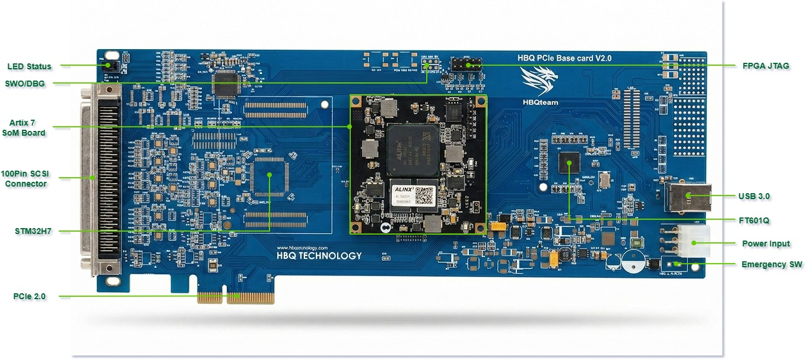
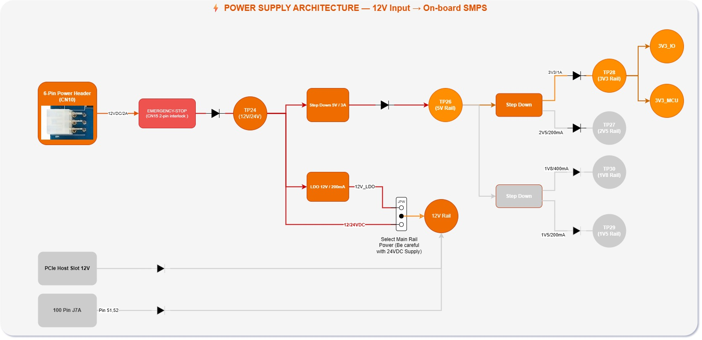
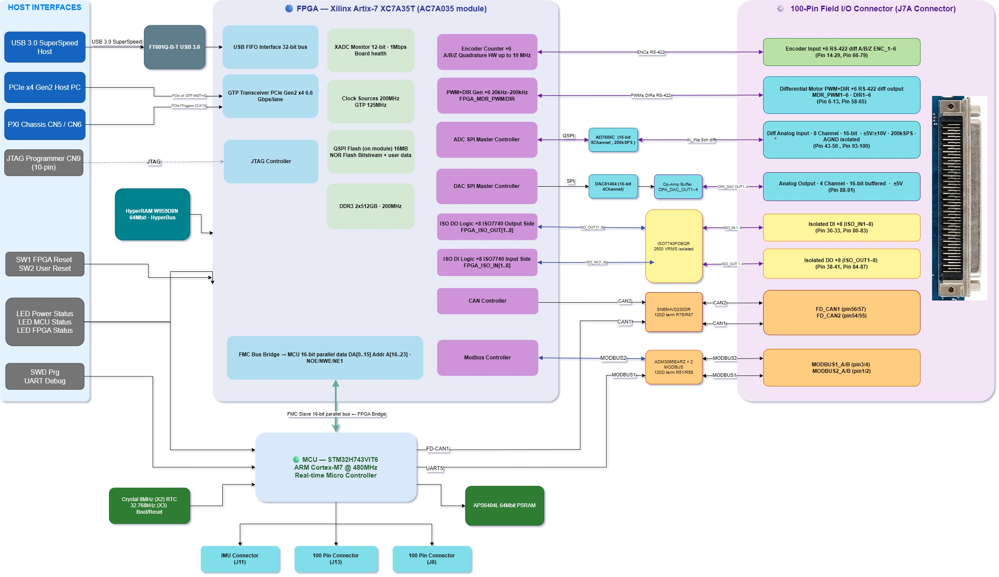

# HBQ PCIe Base Card V2.0

> 🇻🇳 **Card điều khiển chuyển động & thu thập dữ liệu FPGA + MCU hiệu năng cao**  
> 🇬🇧 **High-Performance FPGA + MCU Motion Control & Data Acquisition Card**  
> Nhà sản xuất / Manufacturer: **HBQ Technology** · Rev 2.0 · 01/2026  
> 🌐 [www.hbqtechnology.com](http://www.hbqtechnology.com)


## 📋 Mục lục / Table of Contents

| # | Tiếng Việt | English |
|---|-----------|---------|
| 1 | [Tổng quan sản phẩm](#1-tổng-quan--product-overview) | Product Overview |
| 2 | [Bộ xử lý trung tâm](#2-bộ-xử-lý--core-processors) | Core Processors |
| 3 | [Giao tiếp máy chủ (PCIe/PXI/USB3)](#3-giao-tiếp-máy-chủ--host-interface) | Host Interface |
| 4 | [I/O Analog](#4-io-analog) | Analog I/O |
| 5 | [Điều khiển động cơ](#5-điều-khiển-động-cơ--motion-control-io) | Motion Control I/O |
| 6 | [Digital cách ly](#6-digital-cách-ly--isolated-digital-io) | Isolated Digital I/O |
| 7 | [Truyền thông công nghiệp](#7-truyền-thông-công-nghiệp--fieldbus-comms) | Fieldbus Communications |
| 8 | [Bộ nhớ](#8-bộ-nhớ--memory) | Memory |
| 9 | [Kiến trúc nguồn](#9-kiến-trúc-nguồn--power-architecture) | Power Architecture |
| 10 | [**Connector CN10 — Cấp nguồn Backplane**](#10-connector-cn10--backplane-power-supply) | CN10 Backplane Power |
| 11 | [**Connector J7A — I/O 100 chân**](#11-connector-j7a--100-pin-field-io) | J7A 100-Pin I/O |
| 12 | [**Phân bổ chân FPGA (Pin Assignment)**](#12-phân-bổ-chân-fpga--fpga-pin-assignment) | FPGA Pin Assignment |
| 13 | [Ứng dụng](#13-ứng-dụng--applications) | Applications |
| 14 | [Sơ đồ khối](#14-sơ-đồ-khối--block-diagram) | Block Diagram |
| 15 | [**Hướng dẫn phát triển Vivado**](#15-hướng-dẫn-phát-triển-vivado--vivado-development-guide) | Vivado Dev Guide |
| 16 | [Lập trình & Debug](#16-lập-trình--debug) | Programming & Debug |

---

## 1. Tổng quan / Product Overview

🇻🇳 **HBQ PCIe Base Card V2.0** là card điều khiển chuyển động đa trục và thu thập dữ liệu dạng PCIe/PXI add-in, tích hợp FPGA Xilinx Artix-7 và MCU STM32H7. Card cung cấp khả năng điều khiển servo/stepper real-time, analog I/O chính xác cao, digital I/O cách ly và truyền thông công nghiệp — tất cả truy cập qua PCIe x4 hoặc USB 3.0 từ máy tính chủ.

🇬🇧 The **HBQ PCIe Base Card V2.0** is a multi-axis motion control and data acquisition PCIe/PXI add-in card combining a Xilinx Artix-7 FPGA with an STM32H7 MCU. It delivers real-time servo/stepper control, high-precision analog I/O, isolated digital I/O, and industrial fieldbus — accessible from a host PC via PCIe x4 or USB 3.0.



| Thông số / Parameter | Giá trị / Specification |
|----------------------|------------------------|
| **Form Factor** | PCIe Full-Height · PXI Hybrid Slot compatible |
| **Giao tiếp chủ / Host** | PCIe x4 Gen2 · PXI-Express · USB 3.0 |
| **FPGA** | Xilinx Artix-7 35K — XC7A35T (module ALINX AC7A035) |
| **MCU** | STM32H743VIT6 — ARM Cortex-M7 @ 480 MHz |
| **Trục động cơ / Motor Axes** | 6 × Servo/Stepper (PWM+DIR, RS-422 differential) |
| **Encoder** | 6 × Quadrature A/B/Z (RS-422 differential) |
| **Analog Input** | 8 kênh / ch, 16-bit, ±5V/±10V vi sai / differential |
| **Analog Output** | 4 kênh / ch, 16-bit, có buffer / buffered |
| **Digital cách ly / Isolated DI** | 8 kênh / ch — ISO7740, 2500 VRMS |
| **Digital cách ly / Isolated DO** | 8 kênh / ch — ISO7740, 2500 VRMS |
| **CAN FD** | 2 cổng / ports — SN65HVD230DR |
| **RS-485 / Modbus** | 2 cổng / ports — ADM3065EARZ |
| **USB 3.0** | 1 × Type-B — FT601Q, 32-bit FIFO, ~200 MB/s |
| **E-STOP** | 1 × ngõ vào dừng khẩn / Emergency Stop input (CN15) |
| **Nguồn vào / Power** | 12V qua khe PCIe hoặc backplane PXI |

---

## 2. Bộ xử lý / Core Processors

### 2.1 FPGA — Xilinx Artix-7 35K (XC7A35T)
Gắn qua module **ALINX AC7A035** trên connector **CN8** (40 chân / pin).

| Tài nguyên / Resource | Số lượng / Qty |
|-----------------------|---------------|
| Logic Cells | 33,280 |
| DSP Slices | 50 |
| Block RAM | 1,800 Kbits (90 × 18Kb) |
| GTP MGT Lanes | 4 (dùng cho PCIe x4 / used for PCIe x4) |
| XADC | Tích hợp / Built-in |

**Nhiệm vụ FPGA / FPGA Tasks:** PCIe endpoint · Đếm encoder 6 trục / 6-axis encoder counting · Tạo PWM+DIR 6 trục / 6-axis PWM generation · Giao tiếp ADC/DAC SPI · USB FIFO · ISO DI/DO · CAN/Modbus PHY

### 2.2 MCU — STM32H743VIT6
ARM Cortex-M7 @ 480 MHz, LQFP-100. Giao tiếp FPGA qua bus **FMC** 16-bit.

| Ngoại vi / Peripheral | Chức năng / Function |
|-----------------------|---------------------|
| FMC (16-bit) | Bus song song tới FPGA / Parallel bus to FPGA |
| QSPI | PSRAM ngoài APS6404L (64 Mbit) |
| SPI1, SPI2 | Cảm biến IMU #1, #2, #3 |
| I2C1 | Bus I2C IMU |
| FDCAN1/2 | CAN FD 2 cổng / 2-port CAN FD |
| UART5 | Modbus RTU |
| SWD | Debug (P1) |

---

## 3. Giao tiếp máy chủ / Host Interface

### PCIe x4
- Connector **J1** (PCIE-064-02-X-D-EMS3) — khe PCIe tiêu chuẩn / standard PCIe edge
- 4 lane MGT GTP · Ref clock từ PCIe slot / from PCIe slot
- Reset: PCIE_PERST → FPGA_RESET

### PXI Backplane
- **CN5**: PXI-XP4 Hybrid — 12V/5V/3.3V · TRIG0–7 · CLK10 · GA0–4
- **CN6**: PXI-XP3 — thêm lane tốc độ cao / additional high-speed lanes

### USB 3.0 (độc lập / independent — không cần PCIe)
- Chip: **FT601Q-B-T** (USB 3.0 ↔ 32-bit FIFO async)
- Connector: **CN11** — USB 3.0 Type-B
- Băng thông / Bandwidth: ~200 MB/s · Bus 32-bit + 4-bit byte enable
- ESD: SP3010-04UTG · USBLC6-2SC6 trên VBUS

---

## 4. I/O Analog

### ADC — AD7606C (U4) · 8 kênh đồng thời / 8-ch Simultaneous

| Thông số / Parameter | Giá trị / Value |
|----------------------|----------------|
| Kênh / Channels | 8 vi sai đồng thời / 8 differential simultaneous |
| Độ phân giải / Resolution | 16-bit |
| Dải vào / Input range | ±5V hoặc/or ±10V (chọn qua J4 / select via J4) |
| Tốc độ lấy mẫu / Sample rate | tối đa/max 200 kSPS/ch |
| Giao tiếp / Interface | SPI serial (DOUTA/B/C/D, SDI, SCLK, CS) |
| Tham chiếu / Reference | Nội 2.5V (MCP1525T) hoặc/or ngoại/external (J5) |
| Oversampling | OS0–2: ×1 đến/to ×64 |
| Nguồn / Power | 5V_ADC (qua jumper R39/R43) |

### DAC — DAC81404RHBT (U17) + TL082 buffer · 4 kênh / 4-ch

| Thông số / Parameter | Giá trị / Value |
|----------------------|----------------|
| Kênh / Channels | 4 (OUTA/B/C/D → OPA_DAC_OUT1–4) |
| Độ phân giải / Resolution | 16-bit |
| Buffer ngõ ra / Output buffer | 2× TL082 op-amp (U16, U18) |
| Giao tiếp / Interface | SPI (DAC_SCK/MOSI/MISO/CS/RST/LDAC/CLR) |
| Nguồn analog / Analog power | 12V_LDO + 5V |

---

## 5. Điều khiển động cơ / Motion Control I/O

### 5.1 Encoder Input — 6 trục / 6 Axes (RS-422 Differential)
Receiver: **AM26LV32E** × 6 IC · Termination: 120Ω on-board · Buffer: SN74LVC14A Schmitt

| Trục / Axis | Kênh A / Ch A | Kênh B / Ch B | Index Z |
|-------------|--------------|--------------|---------|
| ENC 1 | ENC_1A± (J7A 26,27) | ENC_1B± (24,25) | ENC_1Z± (76,77) |
| ENC 2 | ENC_2A± (74,75) | ENC_2B± (22,23) | ENC_2Z± (20,21) |
| ENC 3 | ENC_3A± (72,73) | ENC_3B± (70,71) | ENC_3Z± (18,19) |
| ENC 4 | ENC_4A± (16,17) | ENC_4B± (68,69) | ENC_4Z± (66,67) |
| ENC 5 | ENC_5A± (30,31) | ENC_5B± (28,29) | ENC_5Z± (78,79) |
| ENC 6 | — (via CN1–4) | — | — |

### 5.2 Motor Output — 6 trục / 6 Axes (RS-422 Differential)
Driver: **AM26LV31E** × 3 IC · ESD: NUP2105 TVS

| Trục / Axis | PWM Output | DIR Output |
|-------------|-----------|-----------|
| Motor 1 | MDR_PWM1± (J7A 11,12) | MDR_DIR1± (9,10) |
| Motor 2 | MDR_PWM2± (64,65) | MDR_DIR2± (62,63) |
| Motor 3 | MDR_PWM3± (7,8) | MDR_DIR3± (5,6) |
| Motor 4 | MDR_PWM4± (60,61) | MDR_DIR4± (58,59) |
| Motor 5 | MDR_PWM5± (via CN1–4) | MDR_DIR5± |
| Motor 6 | MDR_PWM6± (via CN1–4) | MDR_DIR6± |

---

## 6. Digital cách ly / Isolated Digital I/O

Cách ly qua / Isolated via: **ISO7740FDBQR** × 4 IC · 2500 VRMS · 150 Mbps

### Digital Input — 8 kênh / 8 channels (ISO_IN1–8)

| Kênh / Ch | Chân J7A / J7A Pin | Nguồn cách ly / Iso Power |
|-----------|-------------------|--------------------------|
| ISO_IN1 | 83 | IN_ISOV+ (33) / IN_ISOGND (34) |
| ISO_IN2 | 82 | IN_ISOV+ (33) / IN_ISOGND (34) |
| ISO_IN3 | 81 | IN_ISOV+ (33) / IN_ISOGND (34) |
| ISO_IN4 | 80 | IN_ISOV+ (33) / IN_ISOGND (34) |
| ISO_IN5 | 42 | IN_ISOV+ (33) / IN_ISOGND (34) |
| ISO_IN6 | — | IN_ISOV+ (33) / IN_ISOGND (34) |
| ISO_IN7 | 41 | IN_ISOV+ (33) / IN_ISOGND (34) |
| ISO_IN8 | 32 | IN_ISOV+ (33) / IN_ISOGND (34) |

### Digital Output — 8 kênh / 8 channels (ISO_OUT1–8)

| Kênh / Ch | Chân J7A / J7A Pin | Nguồn cách ly / Iso Power |
|-----------|-------------------|--------------------------|
| ISO_OUT1 | 37 | OUT_ISOV+ (35) / OUT_ISOGND (36) |
| ISO_OUT2 | 38 | OUT_ISOV+ (35) / OUT_ISOGND (36) |
| ISO_OUT3 | 39 | OUT_ISOV+ (35) / OUT_ISOGND (36) |
| ISO_OUT4 | 40 | OUT_ISOV+ (35) / OUT_ISOGND (36) |
| ISO_OUT5 | 84 | OUT_ISOV+ (35) / OUT_ISOGND (36) |
| ISO_OUT6 | 85 | OUT_ISOV+ (35) / OUT_ISOGND (36) |
| ISO_OUT7 | 86 | OUT_ISOV+ (35) / OUT_ISOGND (36) |
| ISO_OUT8 | 87 | OUT_ISOV+ (35) / OUT_ISOGND (36) |

> ⚠️ **VI:** IN_ISOGND và OUT_ISOGND hoàn toàn cách ly nhau và cách ly với GND board. Phải cấp nguồn riêng cho từng khối.  
> ⚠️ **EN:** IN_ISOGND and OUT_ISOGND are fully isolated from each other and from board GND. Each block requires its own power supply.

---

## 7. Truyền thông công nghiệp / Fieldbus Comms

### CAN FD — 2 cổng / 2 ports

| Cổng / Port | Transceiver | Chân J7A / Pin | Điện trở cuối / Term. |
|-------------|------------|----------------|----------------------|
| CAN1 | SN65HVD230DR (U15) | CAN1_P=57, CAN1_N=56 | 120Ω R75 (on-board) |
| CAN2 | SN65HVD230DR (U36) | CAN2_P=55, CAN2_N=54 | 120Ω R87 (on-board) |

### RS-485 / Modbus RTU — 2 cổng / 2 ports

| Cổng / Port | Transceiver | Chân J7A / Pin | Điện trở cuối / Term. |
|-------------|------------|----------------|----------------------|
| Modbus 1 | ADM3065EARZ (U7) | MB1_A=4, MB1_B=3 | 120Ω R51 (on-board) |
| Modbus 2 | ADM3065EARZ (U14) | MB2_A=2, MB2_B=1 | 120Ω R58 (on-board) |

---

## 8. Bộ nhớ / Memory

| Linh kiện / Part | Loại / Type | Dung lượng / Size | Giao tiếp / Interface | Kết nối / Connected |
|-----------------|------------|-------------------|----------------------|---------------------|
| W959D8NFYA5I (U2) | HyperRAM | 64 Mbit | HyperBus | FPGA (TXB0108 level-shift) |
| APS6404L-3SQR-SN (U5) | QSPI PSRAM | 64 Mbit | Quad-SPI | MCU (QSPI) |

---

## 9. Kiến trúc nguồn / Power Architecture



#### Nguồn cách ly cho I/O (Isolated I/O Power)
Để sử dụng Digital Input/Output cách ly trên connector J7A, người dùng **bắt buộc** phải cấp nguồn ngoài (5–30V DC) vào các chân chuyên dụng:
- **IN_ISOV+ / IN_ISOGND**: Cấp nguồn cho khối 8 DI.
- **OUT_ISOV+ / OUT_ISOGND**: Cấp nguồn cho khối 8 DO.
> ⚠️ **Lưu ý:** Hai khối này có GND cách ly hoàn toàn với nhau và với board chính.

---

## 10. Connector CN10 — Backplane Power Supply

### Mô tả / Description

🇻🇳 **CN10** là connector cấp nguồn backplane 6 chân (6-pin header), cấp điện cho card khi dùng trong chassis PXI hoặc backplane tùy chỉnh. Đây là nguồn vào thay thế/song song với khe PCIe (J1).

🇬🇧 **CN10** is a 6-pin backplane power input connector used when the card is installed in a PXI chassis or custom backplane. It provides power in parallel with / as an alternative to the PCIe slot (J1).

### Sơ đồ chân / Pin Diagram

```
       ┌─────────────────┐
  GND  │ 6    ●   ●    3 │ 12V
  GND  │ 5    ●   ●    2 │ 5V (optional)
  GND  │ 4    ●   ●    1 │ GND
       └─────────────────┘
           CN10 (top view)
        BACKPLANE POWER
```

| Chân / Pin | Tín hiệu / Signal | Mức điện áp / Voltage | Chiều / Direction | Mô tả / Description |
|-----------|------------------|----------------------|-------------------|---------------------|
| 1 | GND | 0V | Tham chiếu / REF | GND chung / Common GND |
| 2 | 5V (tùy chọn) | 5V DC | ← Input | Nguồn 5V từ backplane (tuỳ chọn) / Optional 5V from backplane |
| 3 | 12V | 12V DC | ← Input | **Nguồn chính / Main power input** |
| 4 | GND | 0V | Tham chiếu / REF | GND |
| 5 | GND | 0V | Tham chiếu / REF | GND |
| 6 | GND | 0V | Tham chiếu / REF | GND |

> 📌 **VI:** Sơ đồ trên là theo mặc định của schematic — xác minh lại bằng cách đo thực tế trước khi cấp nguồn.  
> 📌 **EN:** Pin assignment above is from schematic analysis — verify by measurement before applying power.

### Mạch bảo vệ nguồn / Power Protection Circuit

```
CN10 (12V vào) → D13 (Schottky diode) → F2 (Cầu chì 2A / 2A fuse)
                                         → C71, C72 (47µF/35V lọc / bulk filter)
                                         → C72, C73 (10µF decoupling)
                                         → VIN rail (tới MAX20006 buck)
```

- **D13**: Diode Schottky bảo vệ ngược cực / Reverse polarity protection diode
- **F2**: Cầu chì 2A bảo vệ quá dòng / 2A fuse for overcurrent protection
- **Tụ lọc / Filter caps**: 47µF/35V + 10µF chống nhiễu / bulk + decoupling

### Hướng dẫn cấp nguồn CN10 / CN10 Wiring Guide

#### Bước 1 / Step 1 — Chuẩn bị / Preparation
🇻🇳
- Dùng nguồn DC 12V ổn định, dòng tối thiểu **3A** (khuyến nghị 5A)
- Chuẩn bị cáp đôi (dây 20AWG trở lên cho 12V, 24AWG cho GND)
- Đảm bảo nguồn tắt trước khi nối / Ensure power is OFF before connecting

🇬🇧
- Use stable 12V DC supply, minimum **3A** current (5A recommended)
- Use 20AWG or thicker wire for 12V rail, 24AWG for GND
- Ensure power supply is OFF before wiring

#### Bước 2 / Step 2 — Nối dây / Wiring
```
Nguồn 12V (+) ──────── CN10 Pin 3 (12V)
Nguồn GND   (−) ──────── CN10 Pin 1 or 4 or 5 (GND)
```

🇻🇳 Nếu dùng cả 5V backplane: nối nguồn 5V vào Pin 2, GND vào Pin 4. 5V tùy chọn — có thể bỏ trống nếu không dùng.

🇬🇧 If using 5V backplane supply: connect 5V to Pin 2, GND to Pin 4. 5V is optional — can be left unconnected.

#### Bước 3 / Step 3 — E-STOP (CN15)

```
     CN15 (2 chân / 2-pin)
     ┌──────┐
  1  │  12V │ ← Nối 12V để card hoạt động / Connect 12V to enable card
  2  │  GND │ ← GND
     └──────┘
```

🇻🇳 **CN15 E-STOP**: Khi dùng nguồn ngoài (không qua khe PCIe), phải kết nối 12V vào CN15 Pin 1 và GND vào Pin 2 để card bật lên. Cắt 12V khỏi CN15 = dừng khẩn cấp phần cứng.

🇬🇧 **CN15 E-STOP**: When powering from backplane (not PCIe slot), connect 12V to CN15 Pin 1 and GND to Pin 2 to enable the card. Disconnecting 12V from CN15 = hardware emergency stop.

#### Thông số an toàn / Safety Specs

| Thông số / Parameter | Min | Typ | Max | Đơn vị / Unit |
|----------------------|-----|-----|-----|--------------|
| Điện áp vào / Input voltage | 11.4 | 12.0 | 12.6 | V DC |
| Dòng vào / Input current | — | 2.5 | 4.0 | A |
| Nhiệt độ vận hành / Operating temp | 0 | 25 | 70 | °C |
| Fuse rating (F2) | — | 2A | 2A | A |

> ⚠️ **CẢNH BÁO / WARNING**: Không cấp nguồn đồng thời từ CN10 và khe PCIe nếu không có diode OR (D12/D44/D15) để tránh dòng ngược giữa hai nguồn điện.

---

## 11. Connector J7A — 100-Pin Field I/O

**Part:** TE Connectivity **5787082-9** · 2×50 pin · Pitch 2.54mm · Có chốt khóa / with latch

### 11.1 Tổng quan nhóm tín hiệu / Signal Group Overview

| Nhóm / Group | Chân (Left) / Pins (L) | Chân (Right) / Pins (R) | Giao tiếp / Interface |
|-------------|----------------------|------------------------|----------------------|
| RS-485 Modbus | 1–4 | — | ADM3065EARZ half-duplex |
| Motor PWM+DIR ch1,3 | 5–12 | — | AM26LV31E RS-422 out |
| Motor PWM+DIR ch2,4 | — | 58–65 | AM26LV31E RS-422 out |
| Encoder ch4 A | 16–17 | — | AM26LV32E RS-422 in |
| Encoder ch3 Z, ch2 Z/B | 18–23 | — | AM26LV32E RS-422 in |
| Encoder ch1 B/A | 24–27 | — | AM26LV32E RS-422 in |
| Encoder ch5 B/A | 28–31 | — | AM26LV32E RS-422 in |
| CAN1, CAN2 | — | 54–57 | SN65HVD230DR |
| Encoder ch4 Z/B, ch3 B/A | — | 66–73 | AM26LV32E RS-422 in |
| Encoder ch2 A, ch1 Z | — | 74–77 | AM26LV32E RS-422 in |
| Encoder ch5 Z | — | 78–79 | AM26LV32E RS-422 in |
| ISO DI5,7,8 | 32,41,42 | — | ISO7740 cách ly / isolated |
| ISO DI1–4 | — | 80–83 | ISO7740 cách ly / isolated |
| Nguồn ISO / ISO power | 33–36 | — | User supply (5–30V) |
| ISO DO1–4 | 37–40 | — | ISO7740 cách ly / isolated |
| ISO DO5–8 | — | 84–87 | ISO7740 cách ly / isolated |
| DAC Output 1–4 | — | 88–91 | DAC81404 + TL082 buffer |
| ADC Input ch5–8 | 43–50 | — | AD7606C 16-bit diff |
| ADC Input ch1–4 | — | 93–100 | AD7606C 16-bit diff |
| GND | 51,52,53,92 | — | Board digital GND |

### 11.2 Bảng chân đầy đủ / Full Pin Table (5787082-9)

> 🇻🇳 Cột trái = pin 1–50 (left column). Cột phải = pin 51–100 (right column). Mỗi hàng là 2 pin đối diện nhau.  
> 🇬🇧 Left column = pins 1–50. Right column = pins 51–100. Each row shows two opposite pins.

**Ký hiệu loại / Signal type legend:**
`[485]`=RS-485 · `[PWM]`=Motor PWM · `[DIR]`=Motor DIR · `[ENC]`=Encoder · `[DI]`=Isolated Input · `[DO]`=Isolated Output · `[ADC]`=Analog In · `[DAC]`=Analog Out · `[CAN]`=CAN bus · `[PWR]`=Power/GND · `[ISO]`=Isolation supply

| Pin L | Tín hiệu trái / Left Signal | Tín hiệu phải / Right Signal | Pin R |
|-------|-----------------------------|------------------------------|-------|
| **1** | `[485]` MODBUS2_B | `[PWR]` GND (D11 12V — **DNP**) | **51** |
| **2** | `[485]` MODBUS2_A | `[PWR]` GND | **52** |
| **3** | `[485]` MODBUS1_B | `[PWR]` GND | **53** |
| **4** | `[485]` MODBUS1_A | `[CAN]` CAN2_N | **54** |
| **5** | `[DIR]` MDR_DIR3− | `[CAN]` CAN2_P | **55** |
| **6** | `[DIR]` MDR_DIR3+ | `[CAN]` CAN1_N | **56** |
| **7** | `[PWM]` MDR_PWM3− | `[CAN]` CAN1_P | **57** |
| **8** | `[PWM]` MDR_PWM3+ | `[DIR]` MDR_DIR4− | **58** |
| **9** | `[DIR]` MDR_DIR1− | `[DIR]` MDR_DIR4+ | **59** |
| **10** | `[DIR]` MDR_DIR1+ | `[PWM]` MDR_PWM4− | **60** |
| **11** | `[PWM]` MDR_PWM1− | `[PWM]` MDR_PWM4+ | **61** |
| **12** | `[PWM]` MDR_PWM1+ | `[DIR]` MDR_DIR2− | **62** |
| **13** | — | `[DIR]` MDR_DIR2+ | **63** |
| **14** | — | `[PWM]` MDR_PWM2− | **64** |
| **15** | — | `[PWM]` MDR_PWM2+ | **65** |
| **16** | `[ENC]` ENC_4A− | `[ENC]` ENC_4Z− | **66** |
| **17** | `[ENC]` ENC_4A+ | `[ENC]` ENC_4Z+ | **67** |
| **18** | `[ENC]` ENC_3Z− | `[ENC]` ENC_4B− | **68** |
| **19** | `[ENC]` ENC_3Z+ | `[ENC]` ENC_4B+ | **69** |
| **20** | `[ENC]` ENC_2Z− | `[ENC]` ENC_3B− | **70** |
| **21** | `[ENC]` ENC_2Z+ | `[ENC]` ENC_3B+ | **71** |
| **22** | `[ENC]` ENC_2B− | `[ENC]` ENC_3A− | **72** |
| **23** | `[ENC]` ENC_2B+ | `[ENC]` ENC_3A+ | **73** |
| **24** | `[ENC]` ENC_1B− | `[ENC]` ENC_2A− | **74** |
| **25** | `[ENC]` ENC_1B+ | `[ENC]` ENC_2A+ | **75** |
| **26** | `[ENC]` ENC_1A− | `[ENC]` ENC_1Z− | **76** |
| **27** | `[ENC]` ENC_1A+ | `[ENC]` ENC_1Z+ | **77** |
| **28** | `[ENC]` ENC_5B− | `[ENC]` ENC_5Z− | **78** |
| **29** | `[ENC]` ENC_5B+ | `[ENC]` ENC_5Z+ | **79** |
| **30** | `[ENC]` ENC_5A− | `[DI]` ISO_IN4 | **80** |
| **31** | `[ENC]` ENC_5A+ | `[DI]` ISO_IN3 | **81** |
| **32** | `[DI]` ISO_IN8 | `[DI]` ISO_IN2 | **82** |
| **33** | `[ISO]` **IN_ISOV+** ← User 5–30V | `[DI]` ISO_IN1 | **83** |
| **34** | `[ISO]` **IN_ISOGND** ← User GND | `[DO]` ISO_OUT5 | **84** |
| **35** | `[ISO]` **OUT_ISOV+** ← User 5–30V | `[DO]` ISO_OUT6 | **85** |
| **36** | `[ISO]` **OUT_ISOGND** ← User GND | `[DO]` ISO_OUT7 | **86** |
| **37** | `[DO]` ISO_OUT1 | `[DO]` ISO_OUT8 | **87** |
| **38** | `[DO]` ISO_OUT2 | `[DAC]` OPA_DAC_OUT2 | **88** |
| **39** | `[DO]` ISO_OUT3 | `[DAC]` OPA_DAC_OUT1 | **89** |
| **40** | `[DO]` ISO_OUT4 | `[DAC]` OPA_DAC_OUT4 | **90** |
| **41** | `[DI]` ISO_IN7 | `[DAC]` OPA_DAC_OUT3 | **91** |
| **42** | `[DI]` ISO_IN5 | `[PWR]` GND | **92** |
| **43** | `[ADC]` AI_IN8+ | `[ADC]` AI_IN1+ | **93** |
| **44** | `[ADC]` AI_IN8− | `[ADC]` AI_IN1− | **94** |
| **45** | `[ADC]` AI_IN7+ | `[ADC]` AI_IN2+ | **95** |
| **46** | `[ADC]` AI_IN7− | `[ADC]` AI_IN2− | **96** |
| **47** | `[ADC]` AI_IN6+ | `[ADC]` AI_IN3+ | **97** |
| **48** | `[ADC]` AI_IN6− | `[ADC]` AI_IN3− | **98** |
| **49** | `[ADC]` AI_IN5+ | `[ADC]` AI_IN4+ | **99** |
| **50** | `[ADC]` AI_IN5− | `[ADC]` AI_IN4− | **100** |

### 11.3 Đặc tính điện tín hiệu J7A / J7A Electrical Specs

| Nhóm / Group | Kiểu tín hiệu / Signal Type | Mức điện áp / Levels | Ghi chú / Notes |
|--------------|---------------------------|----------------------|-----------------|
| Encoder | RS-422 vi sai | 5V Logic | 120Ω on-board, max 10MHz |
| Motor | RS-422 vi sai | 5V Logic | AM26LV31E, Pulse/Dir |
| Analog In | Vi sai (Differential) | ±5V / ±10V | AD7606C 16-bit |
| Analog Out | Đơn cực (Single-ended) | 0–5V / 0–10V | DAC81404 + Op-amp |
| Digital Input | Cách ly (Isolated) | 5V – 30V | Cần cấp nguồn vào IN_ISOV+ |
| Digital Output | Cách ly (Isolated) | 5V – 30V | Cần cấp nguồn vào OUT_ISOV+ |
| CAN FD | Vi sai | CAN bus levels | ISO-11898 compliant |
| RS-485 | Vi sai | RS-485 levels | Half-duplex, 120Ω term |

### 11.3 Hướng dẫn nối dây J7A / J7A Wiring Guide

#### ① Encoder RS-422
```
Encoder (RS-422)          J7A Connector
    A+ ──────────────────── ENC_1A+ (pin 27)
    A− ──────────────────── ENC_1A− (pin 26)
    B+ ──────────────────── ENC_1B+ (pin 25)
    B− ──────────────────── ENC_1B− (pin 24)
    Z+ ──────────────────── ENC_1Z+ (pin 77)
    Z− ──────────────────── ENC_1Z− (pin 76)
   GND ──────────────────── GND     (pin 92)
```
🇻🇳 Không cần thêm điện trở 120Ω — đã có sẵn trên board. Dùng cáp CAT5/6 tối đa 100m.  
🇬🇧 No external 120Ω termination needed — already on board. Use CAT5/6 cable up to 100m.

#### ② Motor Driver PWM+DIR (RS-422)
```
Servo Drive (RS-422)      J7A Connector
  PULSE+ ─────────────── MDR_PWM1+ (pin 12)
  PULSE− ─────────────── MDR_PWM1− (pin 11)
   DIR+  ─────────────── MDR_DIR1+ (pin 10)
   DIR−  ─────────────── MDR_DIR1− (pin 9)
   GND   ─────────────── GND       (pin 92)
```
🇻🇳 Tương thích với: Delta ASDA-B3, Mitsubishi MR-J4, Panasonic MINAS-A6, Leadshine ES-D508.  
🇬🇧 Compatible with: Delta ASDA-B3, Mitsubishi MR-J4, Panasonic MINAS-A6, Leadshine ES-D508.

#### ③ Analog Input ADC (16-bit differential)
```
Sensor/Transmitter        J7A Connector
  Signal (+) ──────────── AI_IN1+  (pin 93)
  Signal (−) ──────────── AI_IN1−  (pin 94)
  AGND       ──────────── GND      (pin 92)  ← AGND chỉ ở 1 điểm / single-point AGND
```
🇻🇳 Chọn dải ±5V hoặc ±10V qua jumper **J4** trên board. Không nối AGND với GND số ở nhiều điểm.  
🇬🇧 Select ±5V or ±10V range via jumper **J4** on board. Single-point AGND connection only.

#### ④ Isolated Digital I/O (DI/DO cách ly)
```
Nguồn PLC 24VDC           J7A Connector
  24VDC (+) ───────────── IN_ISOV+   (pin 33)  ← Cấp nguồn DI / DI supply
  24VDC (−) ───────────── IN_ISOGND  (pin 34)
  Sensor NPN ──────────── ISO_IN1    (pin 83)
  
  24VDC (+) ───────────── OUT_ISOV+  (pin 35)  ← Cấp nguồn DO / DO supply
  24VDC (−) ───────────── OUT_ISOGND (pin 36)
  Load (+)   ──────────── ISO_OUT1   (pin 37)
  Load (−)   ──────────── OUT_ISOGND (pin 36)
```
🇻🇳 Mức cách ly: **2500 VRMS**. Dải nguồn cách ly: 5–30V DC. Hai khối DI và DO có GND hoàn toàn độc lập.  
🇬🇧 Isolation: **2500 VRMS**. Isolation supply range: 5–30V DC. DI and DO blocks have fully independent grounds.

#### ⑤ CAN FD
```
CAN Bus (RS-485 level)    J7A Connector
  CANH ────────────────── CAN1_P (pin 57)
  CANL ────────────────── CAN1_N (pin 56)
  GND  ────────────────── GND    (pin 92)
```
🇻🇳 120Ω đã có trên board (R75). Nếu không phải đầu cuối bus → tháo R75.  
🇬🇧 120Ω already on board (R75). If not a bus endpoint → remove R75.

#### ⑥ RS-485 / Modbus RTU
```
RS-485 Device             J7A Connector
    A (+) ───────────────── MODBUS1_A (pin 4)
    B (−) ───────────────── MODBUS1_B (pin 3)
   GND   ───────────────── GND        (pin 92)
```
🇻🇳 Half-duplex, hướng TX/RX tự động. 120Ω termination (R51) đã có trên board.  
🇬🇧 Half-duplex, auto TX/RX direction. 120Ω termination (R51) already on board.

---

## 12. Ứng dụng / Applications

### 🤖 12.1 Robot / CNC đa trục / Multi-Axis CNC & Robot Arm
🇻🇳 Điều khiển 6 trục servo qua PCIe + FPGA interpolation real-time. Encoder feedback đến 10MHz. Modbus RTU đến VFD/HMI.  
🇬🇧 6-axis servo control via PCIe + FPGA real-time interpolation. Encoder feedback up to 10MHz. Modbus RTU to VFD/HMI.

### 📊 12.2 Thu thập dữ liệu / High-Speed DAQ
🇻🇳 8 kênh ADC 16-bit đồng thời 200kSPS. Streaming USB 3.0 ~200MB/s. DAC 4 kênh kích thích tín hiệu.  
🇬🇧 8-ch simultaneous 16-bit ADC at 200kSPS. USB 3.0 streaming ~200MB/s. 4-ch DAC for stimulus signals.

### 🏭 12.3 Tự động hoá công nghiệp / Industrial Automation (PC-PLC)
🇻🇳 8DI + 8DO cách ly 24VDC. CAN FD CANopen/CiA 402. RS-485 Modbus RTU. PREEMPT-RT Linux.  
🇬🇧 8DI + 8DO isolated 24VDC. CAN FD CANopen/CiA 402. RS-485 Modbus RTU. PREEMPT-RT Linux.

### 🚀 12.4 Thiết bị test PXI / PXI ATE Test Equipment
🇻🇳 Cài trong chassis PXI tiêu chuẩn. Trigger bus TRIG0–7. CLK10MHz đồng bộ hệ thống.  
🇬🇧 Install in standard PXI chassis. Trigger bus TRIG0–7. CLK10MHz system synchronization.

### 🎓 12.5 Nghiên cứu robot / Robotics Research
🇻🇳 FPGA hard real-time + MCU soft real-time. Cổng IMU J11 cho gyro/accelerometer. Vivado WebPACK miễn phí.  
🇬🇧 FPGA hard real-time + MCU soft real-time. IMU port J11 for gyro/accelerometer. Free Vivado WebPACK.

### 🔬 12.6 Chuyển động chính xác / Precision Motion (Semiconductor/Optics)
🇻🇳 DAC 16-bit cho piezo/galvo. ADC 16-bit đo sensor quang. PID loop FPGA >100kHz.  
🇬🇧 16-bit DAC for piezo/galvo control. 16-bit ADC for optical sensor. FPGA PID loop >100kHz.

---

## 13. Sơ đồ khối / Block Diagram


---

## 12. Phân bổ chân FPGA / FPGA Pin Assignment

Hệ thống sử dụng module **ALINX AC7A035** (FPGA **XC7A35T-2FGG484I**). Các tín hiệu quan trọng được phân bổ trên 4 connector B2B (CN1–CN4).

### 12.1 Tín hiệu hệ thống & USB (Xilinx Constraints)
Tham khảo file `artix7_35K_pin_assignment.xdc` để lập trình:

| Chức năng / Function | Tên port port (XDC) | Package Pin | Ghi chú |
|----------------------|--------------------|-------------|---------|
| **GTP Ref Clock** | `clk_in_clk_p` | **R4** | 125MHz Differential |
| **USB 3.0 Clock** | `usb_clk` | **Y22** | FT601Q 100MHz |
| **USB WR Strobe** | `wr_n` | **R19** | Write enable |
| **USB TXE#** | `txe_n` | **U17** | FIFO status |
| **USB RXF#** | `rxf_n` | **U18** | FIFO status |
| **DAC SPI SCK** | `sclk` | **G22** | DAC Clock |
| **DAC SPI MOSI** | `mosi` | **G20** | DAC Data |
| **LED Vàng (Yellow)** | `vang` | **L18** | Status LED |
| **LED Xanh (Green)** | `xanh` | **N19** | Status LED |

### 12.2 Bản đồ bus ADC/DAC/Motor (Bank B15/B16)
Chip Artix-7 giao tiếp với các ngoại vi base board chủ yếu qua Bank 15 và 16 (VCCO = 3.3V).

- **Motor PWM/DIR**: Tín hiệu ra logic 3.3V trước khi qua AM26LV31E chuyển sang RS-422.
- **Encoder**: Tín hiệu từ AM26LV32E chuyển về logic 3.3V vào FPGA.
- **FMC Bus**: 16-bit dữ liệu song song kết nối MCU STM32H743 qua Bank 16.

---

## 15. Hướng dẫn phát triển Vivado / Vivado Development Guide

Dành cho kỹ sư phát triển firmware FPGA trên môi trường **Xilinx Vivado**.

### 15.1 Thiết lập Project (Project Setup)
1. **Target Device**: Chọn Part `xc7a35tfgg484-2`. Artix-7 35K speed grade -2.
2. **Clocking**:
   - Nguồn clock chính 125MHz vi sai từ chân **R4** (GTP reference).
   - Sử dụng **Clocking Wizard IP** để tạo các clock logic (100MHz, 200MHz) từ nguồn này.
3. **Constraints**: Add file `artix7_35K_pin_assignment.xdc` vào project.

### 15.2 Các IP Core quan trọng
- **PCI Express**: Sử dụng `7 Series Integrated Block for PCI Express`. Thiết lập Lane Width: `X4`, Link Speed: `5.0 Gb/s (Gen2)`.
- **USB 3.0**: Sử dụng kiến trúc FIFO 32-bit tương thích FT601Q. Lưu ý constraint `CLOCK_DEDICATED_ROUTE FALSE` cho chân `usb_clk`.
- **Memory Interface (MIG)**: Để sử dụng HyperRAM hoặc DDR3 trên module, cấu hình MIG với clock 200MHz/400MHz.

### 15.3 Workflow Lập trình
1. **Tổng hợp & Implement**: Chạy `Run Synthesis` và `Run Implementation`.
2. **Tạo Bitstream**: `Generate Bitstream`.
3. **Nạp Card**:
   - Sử dụng mạch nạp JTAG (Xilinx Platform Cable USB II) nối vào **CN9**.
   - Cấp nguồn 12V cho card (qua PCIe hoặc CN10).
   - Mở **Vivado Hardware Manager** để nạp file `.bit`.

### 15.4 Gợi ý Debug
- Sử dụng **Integrated Logic Analyzer (ILA)** IP để quan sát tín hiệu thời gian thực.
- Theo dõi 2 LED trạng thái (`vang`, `xanh`) để báo hiệu trạng thái firmware.

---

## 16. Lập trình & Debug / Programming & Debug

### 16.1 FPGA Programming — CN9 (JTAG)

| Thông số / Parameter | Giá trị / Value |
|----------------------|----------------|
| Connector | CN9 — 10-pin, pitch 2.54mm |
| Tín hiệu / Signals | FPGA_TCK, FPGA_TDI, FPGA_TDO, FPGA_TMS |
| ESD protection | BAS40-04 Schottky + 33Ω series (R119–R121, R150) |
| Phần mềm / Tool | Xilinx **Vivado / Vitis** (WebPACK — miễn phí / free) |
| Nạp / Bitfile | JTAG volatile · SPI Flash persistent (AC7A035 module) |

### 16.2 MCU Programming — P1 (SWD)

| Thông số / Parameter | Giá trị / Value |
|----------------------|----------------|
| SWD port | P1 — 3-pin (SWCLK, SWDIO, GND) |
| Debug UART | P2 — DBG_TX, DBG_RX |
| Boot mode | SW4 → BOOT0 high → DFU mode |
| IDE | STM32CubeIDE · OpenOCD · ST-Link V2 · J-Link |

### 16.3 Chỉ thị trạng thái / Status Indicators

| Linh kiện / Part | Chức năng / Function |
|-----------------|---------------------|
| **LED1** | Đèn trạng thái / Status LED (FPGA_LED_ST — firmware điều khiển / controlled) |
| **SW1** | Reset board → MCU NRST |
| **SW2** | DIP 8 vị trí / 8-position → MCU GPIO người dùng / user GPIO |
| **FPGA_BUTTON** | Nút người dùng → FPGA fabric |

### 16.4 Test Points / Điểm đo

| Nhóm / Group | Tín hiệu / Signals |
|-------------|-------------------|
| TP1–TP5 | ADC serial: DOUTA–D, SDI, SCLK, CS |
| TP6–TP23 | Encoder: ENC1–ENC6 A/B/Z |
| TP24–TP30 | Nguồn / Power rails: 12V, 5V, 3.3V, 2.5V, 1.8V, 1.5V, GND |
| TP31–TP35 | MCU / USB supply + debug |
| TP42–TP57 | DAC/ADC analog: OPA_DAC_OUT, ADC_VREF |
| TP87–TP94 | ADC control: BUSY, FRSTDATA, serial lines |

---

## Lịch sử phiên bản / Revision History

| Rev | Ngày / Date | Thay đổi / Changes |
|-----|------------|-------------------|
| 2.0 | 01/12/2026 | Phiên bản sản xuất hiện tại / Current production release |

---

*🏭 HBQ Technology · www.hbqtechnology.com*  
*📄 Tài liệu được tạo từ / Document generated from: `Sch_PCIEBaseCard_Rev2_0.pdf` (9 sheets)*  
*🔧 FPGA: Xilinx Artix-7 XC7A35T · MCU: STM32H743VIT6 · USB: FT601Q · ADC: AD7606C · DAC: DAC81404*
